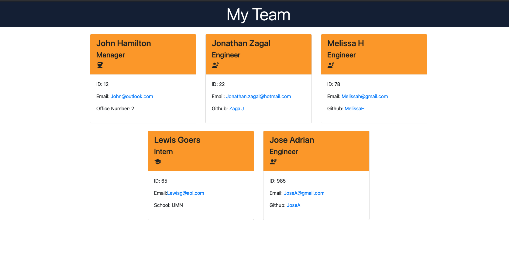

# 10 Object-Oriented Programming: Team Profile Generator


## Description

This is an application that was created to generate a team profile with help of technologies like Inquirer and Jest.

## Table of Contents
* [Installation](#installation)
* [Usage](#usage)
* [License](#license)
* [Contributing](#contributing)
* [Tests](#tests)
* [Questions](#questions)

## Installation

Start by clonning the repository from GitHub and download [Node.js](http://nodejs.org/). 

```sh 
npm i
```
## Usage
run the comands to test and launch the app.
```sh 
npm run test
```
```sh 
node index.js
```

You can also watch me demo the app by clicking this [link](https://drive.google.com/file/d/15DlBoFFD0hmgt7QWPhZAPHPOTLotyGqG/view?usp=sharing) 
![screenshot] 

## License 
This project is licensed under MIT

## Contributing
Web Dev simplified

## Tests
Use command to run test
```sh 
npm run test
```

## Questions
If you have any questions about this projects, please contact me directly at Jonathan.Zagal@hotmail.com. You can view more of my projects at https://github.com/ZagalJ.
